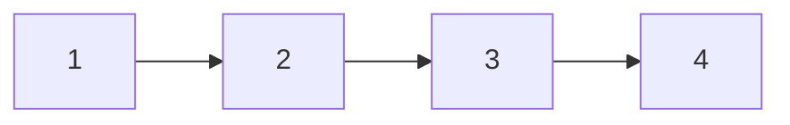
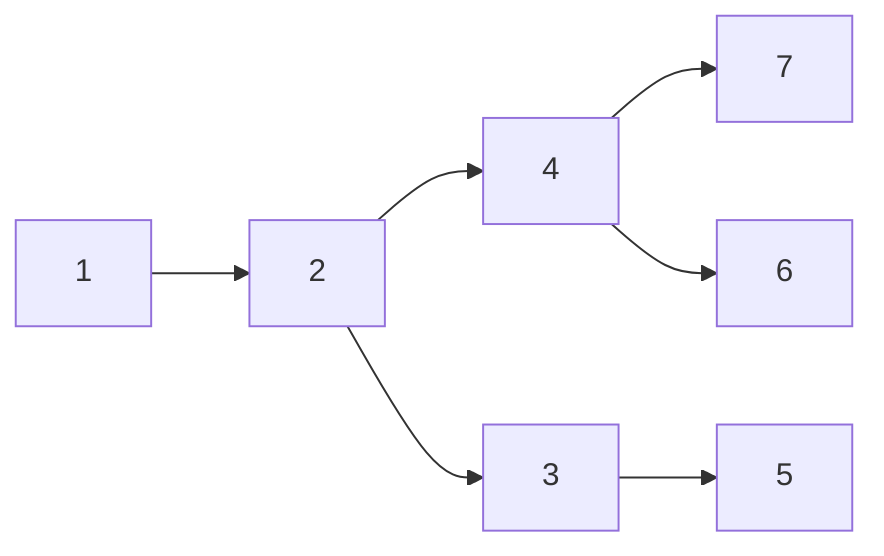

# Linear and Non-Linear Data Structures

## Linear Data Structures

is used to store multiple items of same type of data in continuous memory location e.g:- Array

there are two type of **Arrays** 
- _**Normal Array**_
- _**Referintial Array**_

Excalidraw

# Non-Linear Data Structures

