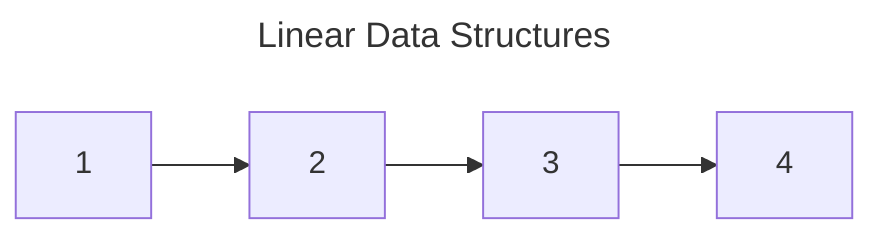
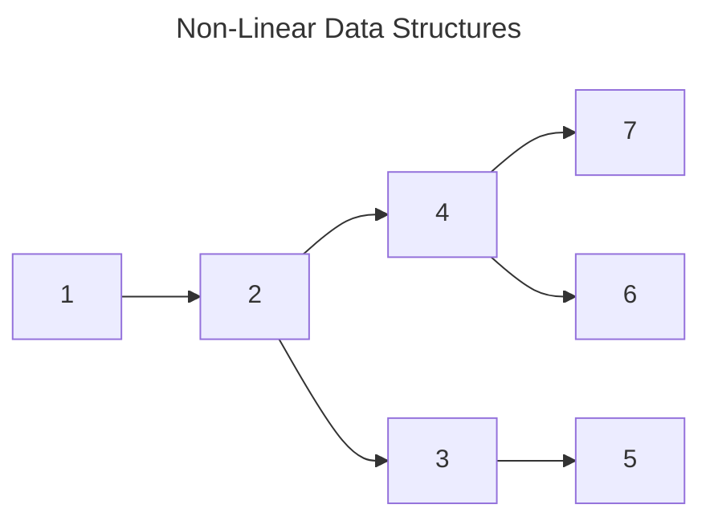

# Linear and Non-Linear Data Structures

there are two type of **Arrays** 
- _**Normal Array**_
- _**Referintial Array**_

## Linear Data Structures
Linear data structures are a type of data structure in which data elements are arranged sequentially or linearly. Each element has a previous and next adjacent, except for the first and last elements[3]. Some examples of linear data structures include:

    Arrays: Arrays are a collection of elements of the same data type that are stored in contiguous memory locations. Elements in an array can be accessed using their index, which represents their position in the array. Arrays provide constant-time access to elements, making them efficient for random access but less efficient for insertion and deletion operations.

    Linked Lists: Linked lists are made up of nodes, where each node contains a data element and a reference (or link) to the next node in the list. Unlike arrays, linked lists do not require contiguous memory allocation and can grow or shrink dynamically. Linked lists provide efficient insertion and deletion operations but have slower access times compared to arrays since elements need to be traversed sequentially.

    Stacks: Stacks are a type of linear data structure that follows the Last-In-First-Out (LIFO) principle. In a stack, elements are added and removed from the same end, known as the top of the stack. Stacks can be implemented using arrays or linked lists. Common stack operations include push (add an element to the top) and pop (remove an element from the top).

    Queues: Queues are a linear data structure that follows the First-In-First-Out (FIFO) principle. In a queue, elements are added at one end (rear) and removed from the other end (front). Queues can also be implemented using arrays or linked lists. Common queue operations include enqueue (add an element to the rear) and dequeue (remove an element from the front).

# Non-Linear Data Structures

Non-linear data structures are those in which the elements are not organized sequentially but have a more complex relationship with each other. They do not follow a linear progression or a simple order, unlike linear data structures such as arrays or linked lists. Non-linear data structures are used when data is not easily modeled by a linear sequence or when there is a need for complex data relationships[1]. Some examples of non-linear data structures include:

    Trees: Trees are hierarchical data structures that consist of nodes connected by edges. Each node can have zero or more child nodes, except for the root node, which has no parent. Trees are widely used in computer science, such as in file systems, organization hierarchies, and search algorithms. Common types of trees include binary trees, AVL trees, and B-trees.

    Graphs: Graphs are non-linear data structures that consist of a set of vertices (nodes) and edges that connect these vertices. Graphs can be used to represent relationships between objects, such as social networks, computer networks, and transportation networks. Graphs can be directed (edges have a specific direction) or undirected (edges have no direction). Common graph algorithms include depth-first search (DFS) and breadth-first search (BFS).

    Heaps: Heaps are specialized tree-based data structures that satisfy the heap property. Heaps are commonly used to implement priority queues, where elements with higher priority are given preference for removal. Heaps can be implemented as binary heaps or Fibonacci heaps, among others.

In summary, linear data structures store data in a sequential manner, allowing for efficient access and manipulation. Examples of linear data structures include arrays, linked lists, stacks, and queues. On the other hand, non-linear data structures store data in a hierarchical or complex manner, allowing for more flexible relationships between elements. Examples of non-linear data structures include trees, graphs, and heaps. The choice of data structure depends on the specific requirements of a given application and the trade-offs between performance, complexity, and scalability